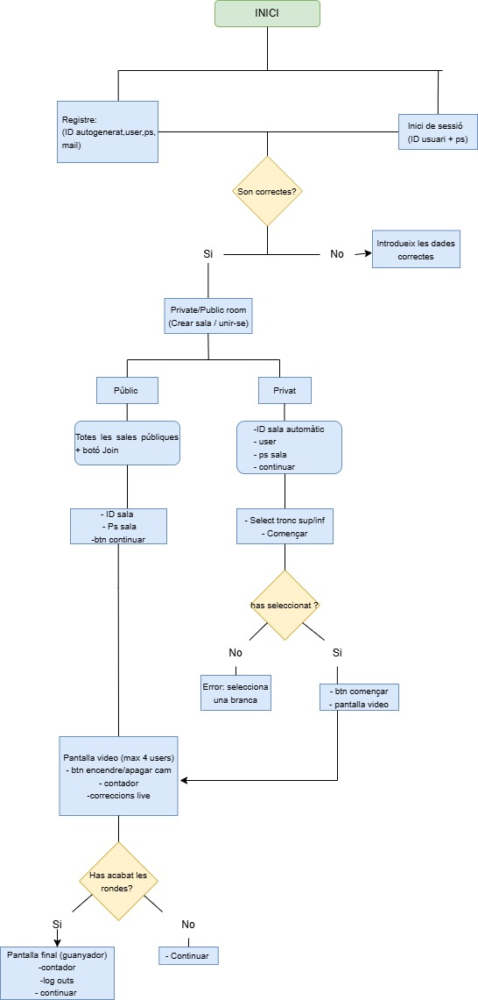

<!-- # Documentació
Llistat d'alguns dels punts que han de quedar explicats en aquesta carpeta. Poden ser tots en aquest fitxer o en diversos fitxers enllaçats.

És obligatori modificar aquest document!!

## Documentació bàsica MÍNIMA
 * Objectius
 * Arquitectura bàsica
   * Tecnologies utilitzades
   * Interrelació entre els diversos components
 * Com crees l'entorn de desenvolupament
 * Com desplegues l'aplicació a producció
 * Llistat d'endpoints de l'API de backend (també podeu documentar-ho amb swagger)
    * Rutes
   * Exemples de JSON de peticó
   * Exemples de JSON de resposta i els seus codis d'estat 200? 404?
 * Aplicació Android
 * Altres elements importants.
 * ...
 -->
 Fitness Pro (Projecte TR1 DAM)

Aquest repositori conté el codi font del projecte "Fitness Pro", una aplicació online en temps real per a la realització d'exercicis en grup. El projecte s'ha desenvolupat com a part del mòdul TR1 (Tècniques de Realització) de DAM.

L'objectiu principal és crear una plataforma on els usuaris puguin registrar-se, crear sales d'exercici (públiques o privades) i realitzar rutines de forma sincronitzada amb altres participants.

Característiques Principals

    Sistema d'Autenticació: Registre i Log In d'usuaris.

    Gestió de Sales: Capacitat de crear i unir-se a sales públiques o privades (amb ID de sala).

    Lobby d'Exercici: Sala d'espera on els participants es reuneixen i poden seleccionar el tipus d'exercici (ex. Tronc Superior, Tronc Inferior) abans de començar.

    Sessió en Temps Real: Durant l'exercici, els usuaris poden veure el progrés dels altres participants.

    Recompte de Repeticions: L'aplicació compta les repeticions (ex. "10/20") de forma sincronitzada.

    Leaderboard: En finalitzar la sessió, es mostra una pantalla de resultats i rànquing.

Arquitectura del Sistema

El projecte segueix una arquitectura Client-Servidor, amb una forta dependència de la comunicació en temps real mitjançant WebSockets.

    Client: (Potencialment Android, iOS o Web) És responsable de la interfície d'usuari (UI) i d'enviar les accions de l'usuari al servidor.

    Servidor: Gestiona la lògica de negoci, l'estat de les sales, els participants i orquestra la comunicació entre tots els clients connectats a una mateixa sala.

    Emmagatzematge: (Base de dades) Persisteix la informació dels usuaris, sales i, possiblement, els resultats.

Comunicació per WebSockets (WS)

La comunicació en temps real es gestiona amb els següents esdeveniments principals de WebSocket:

    WS: Creu/Adereix a Sala: Envia la petició per crear o unir-se a una sala.

    WS: Demana Sales: El client sol·licita la llista de sales públiques disponibles.

    WS: Retorn Sales: El servidor envia la llista de sales al client.

    WS: Usuari Posa REP: El client notifica al servidor que l'usuari ha completat una repetició.

    WS: Actualitza: El servidor envia una actualització d'estat a tots els clients d'una sala (ex. un nou usuari s'ha unit, el recompte de repeticions d'algú ha canviat).

🌊 Flux de l'Aplicació

El flux d'usuari dissenyat és el següent:

    Pantalla 1: Log In / Registre

        L'usuari inicia sessió amb el seu usuari i contrasenya.

        Hi ha una opció per anar al formulari de registre (que demana Nom, Cognoms, Mail, Data de Naixement, etc.).

    Pantalla 2: Selecció de Sala

        Un cop autenticat, l'usuari veu una llista de sales.

        Pot filtrar per sales públiques (PU) o privades (PR).

        Té opcions per "Crear Sala" o unir-se a una existent.

    Pantalla 3: Lobby (Sala d'Espera)

        Els participants es reuneixen aquí abans de començar.

        Es mostra l'ID de la sala i el tipus (Pública/Privada).

        Es pot seleccionar el tipus d'exercici (ex. "Tronco Sup", "Tronco Inf").

        El líder de la sala prem el botó "COMENÇAR".

    Pantalla 4: Sessió d'Exercici (Temps Real)

        És la pantalla principal de l'activitat.

        Es mostra la "Pantalla video" (o representació) dels participants.

        Un comptador global o individual mostra el progrés de les repeticions.

        Un compte enrere ("3, 2, 1... JA!") inicia l'activitat.

    Pantalla 5: Fi i Resultats

        Un cop finalitzada la rutina, es mostra la pantalla de "FIN".

        Presenta un "Leaderboard" amb els resultats, temps i el "Millor Temps".

## Diagramas

### Del web

### Del Flux

### Del Store Pinia

